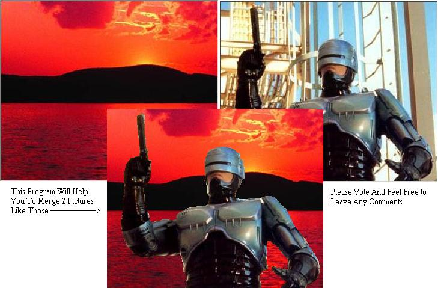



## Merge Pictures

### Description

Hi,This Is Code Will Help You To Merge 2 Pictures

It Is Easy And CoOl Check The ScreenShot

Its Simple And Easy To Understand

If You Like It Please Vote And Leave A comment.

i Wish it Helped You.
 
### More Info
 

             |
---                |---
**Submitted On**   |2003-05-28 11:17:12
**By**             |[Ahmad Mami](https://github.com/Planet-Source-Code/PSCIndex/blob/master/ByAuthor/ahmad-mami.md)
**Level**          |Intermediate
**User Rating**    |4.8 (19 globes from 4 users)
**Compatibility**  |VB 5\.0, VB 6\.0
**Category**       |[Graphics](https://github.com/Planet-Source-Code/PSCIndex/blob/master/ByCategory/graphics__1-46.md)
**World**          |[Visual Basic](https://github.com/Planet-Source-Code/PSCIndex/blob/master/ByWorld/visual-basic.md)
**Archive File**   |[Merge\_Pict1593285282003\.zip](https://github.com/Planet-Source-Code/ahmad-mami-merge-pictures__1-45777/archive/master.zip)

